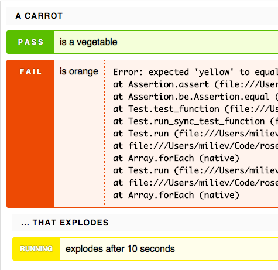

# Rosehip

A simple, no-magic JavaScript unit testing library for browsers and Node.JS.

Because [Mocha](http://mochajs.org) is very nice, but uses a lot of magic to define tests, making it very compilcated to use in the middle of a pipeline (say, if one wants to compile the tests using CoffeeScript or Babel).

Therefore, Rosehip's unit tests are a regular JavaScript object with a `run()` function.




## Install

### Node.JS or Browserify:

`npm install --save-dev rosehip`

### Browser standalone:


Download `rosehip.js` (and `rosehip.css`!) and include it:

```html
<link rel="stylesheet" href="rosehip.css"/>
<script type="application/javascript" src="rosehip.js"></script>
```

## Setup
### Node.JS or Browserify:

```javascript
var rosehip = require('rosehip')
var expect = require('expect.js') // Optional; you can use Node's assert or should.js or anything else
```

### Both Node.JS and standalone:

``` javascript
var test_suite = new rosehip.Test()
```
### Reporters

Output to `console.log`:
```javascript
  var reporter = new rosehip.ConsoleReporter(test_suite)
```

Or, if running in a browser, get a pretty dashboard:
```javascript
  var element = document.getElementById('test_report')
  var reporter = new rosehip.WebReporter(element, test_suite)
```

## Defining Tests
```javascript
var test_suite = new rosehip.Test()

// A carrot
var carrot = {
  type: "vegetable",
  color: "yellow", // this carrot is weird
  wind: function(callback){
    var self = this // setTimeout steals 'this'
    setTimeout(function(){
      self.exploded = true
      callback()
    }, 10000)
  } // I knew it. Yellow carrots?
}

test_suite.describe("A carrot", function(test){
  test.it("is a vegetable", function(){
    expect(carrot.type).to.equal("vegetable")
  })

  test.it("is orange", function(){
    expect(carrot.color).to.equal("orange")
  })

  test.describe("that explodes", function(test){
    test.it("explodes after 10 seconds", function(done){
      carrot.wind(function(){
        expect(carrot.exploded).to.equal(true)
        done() // if this is not called after 60 seconds, test fails.
      })
    })
  })
})

var reporter = new rosehip.WebReporter(document.getElementById('rosehip_report'), test_suite)
setTimeout(function(){
  test_suite.run()
}, 1000)

```

Also take a look at these examples:

* Standalone: [test/standalone.html](test/standalone.html)
* Browserify: [test/src/browserify_test.js](test/src/browserify_test.js)
* Node.js:    [test/node.js](test/node.js)

## Running

```javascript
test_suite.run()
```
